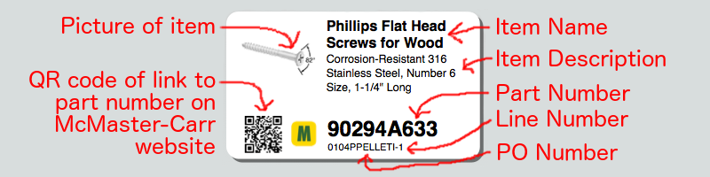
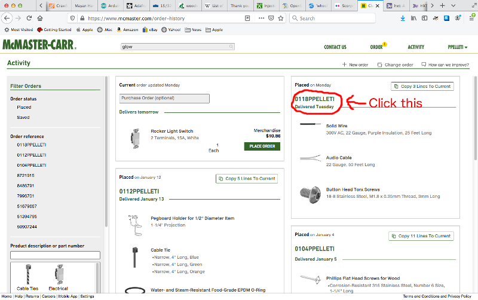

McLabel is a command-line program which will process your
[McMaster-Carr][1] receipt/invoice in HTML format, and generate a
label for each item in [DYMO Label v.8 XML format][4], suitable for
printing on [Large White Shipping Labels (30256)][3] with a
[DYMO LabelWriter][5] printer, using [DYMO Label Software][6] for Mac
or Windows.



## Motivation

When I buy parts, I like to keep them in the original bag, so that I
know what the part is and how to reorder it.  This works great with
parts from [Digi-Key][7], because their bags come with a label that
contains all sorts of useful information, including the part number,
and a description of the part.  Some of this information is also
reproduced in machine-readable form in a [DataMatrix 2D bar code][8]
on the label.

However, when I buy parts from McMaster-Carr, each bag comes with only
a single handwritten number on it, which is the number of the line
item on the receipt.  This is all you need for identifying parts in
the context of a particular receipt.  But once you separate the bag
from the receipt, the number becomes meaningless.

Therefore, I wrote this program so that I can print out my own labels
to affix to the bags when I receive my McMaster-Carr order.  (At least
for any items I intend to keep in the bag.)  I have a
[LabelWriter 450][5] printer, so the output is targeted to the DYMO
Label Software that comes with that printer.

## Usage

```
Usage: mclabel [options] HTMLFILE ...

    -d  --dest-dir=DIR        Set directory for output files
                           (Default: '~/Documents/DYMO Label Software/Labels')
    -p  --prefix=STRING       Set prefix for output file names (Default: 'Mc')

    -v  --version             Print version and exit
    -h  --help                Print this message and exit
```

On the [McMaster-Carr website][1], click on the [Activity][2] link at
the top of the screen.  Click on one of your purchase order numbers
(such as "0104PPELLETI" in my case).  Now the website should be
displaying your receipt (or invoice, or whatever, not sure what to
call it).  Now choose "Save Page As..." from the File menu.  Select
the format to be "Web Page, complete" and give it a name (I prefer to
name it after the purchase order number, but that is not required) and
hit "Save".  If you have multiple purchase orders, you can repeat for
each one.



Now go to the command line and run `mclabel` on the HTML file you just
saved.  For example,

```
mclabel ~/orders/McMaster-Carr/0104ppelleti.html
```

You can specify more than one HTML file on the command line if you
want to process multiple purchase orders.

McLabel will create one file for each item in your purchase order.
They will be named something like `Mc0104PPELLETI-007.label`, where
`0104PPELLETI` is the purchase order number, and `007` is the item's
line number on the receipt.

By default, McLabel will put its output files in either
`~/Documents/DYMO Label Software/Labels` or
`~/Documents/DYMO Label/Labels`, if one of those directories exists.
However, you can change the output directory by specifying the
`-d` or `--dest-dir` option on the command line.

You can change the default `Mc` prefix for output file names with the
`-p` or `--prefix` option.

Once you have run McLabel, you can open the "DYMO Label" application
and choose "Open..." from the File menu.  Then pick one of the label
files created by McLabel.  Then you can print it.  (Unfortunately, you
need to do this for each label; I don't know of a way to print them
all at once.)  The label files are formatted to be printed on
[Large White Shipping Labels (30256)][3].

## Installation

McLabel is written in [Haskell][12].  If you're familiar with
Haskell, you already know how to build McLabel.  McLabel can
be built with either [Cabal][9] or [Stack][10].

If you're not familiar with Haskell, here's the quick-start:

* Clone this repo
* [Install Stack][11]
* In the top directory of this repo, run `stack --install-ghc install`
* Wait a really long time (it only takes this long the first time)

This will copy `mclabel` to the directory `~/.local/bin`.  (Or on
Windows, `%APPDATA%/local/bin`.)  You can either put that directory on
your `PATH`, or copy the binary to wherever you want to have it.


[1]: https://www.mcmaster.com/
[2]: https://www.mcmaster.com/order-history
[3]: https://smile.amazon.com/gp/product/B00004Z64O/
[4]: https://developers.dymo.com/2010/03/24/understanding-label-file-formats-in-dymo-label-v-8-label-objects/
[5]: https://www.dymo.com/en-US/dymo-labeling-needs/mailing-shipping-labeling/mailing-shipping-labeling/labelwriter-450-label-printer
[6]: https://www.dymo.com/en-US/dymo-user-guides
[7]: https://www.digikey.com/
[8]: https://hackaday.io/project/90456-ar-workbench/log/131388-reading-digikey-barcodes
[9]: https://www.haskell.org/cabal/
[10]: https://haskellstack.org/
[11]: https://docs.haskellstack.org/en/stable/install_and_upgrade/
[12]: https://www.haskell.org/
